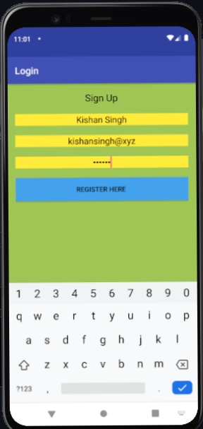

# CGPA Calculator Using SQLite Login/Register

Register & Login App with SQLite DB

It is a Simple CGPA Calculator App in which user can calculate their cgpa very easily. It also works when user is not connected to internet.

It is built to work on Android 5.1 & above

Technologies used: Android, Java, XML, SQLite

IDE: Android Studio 3.1

